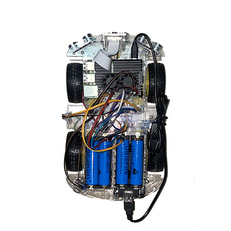
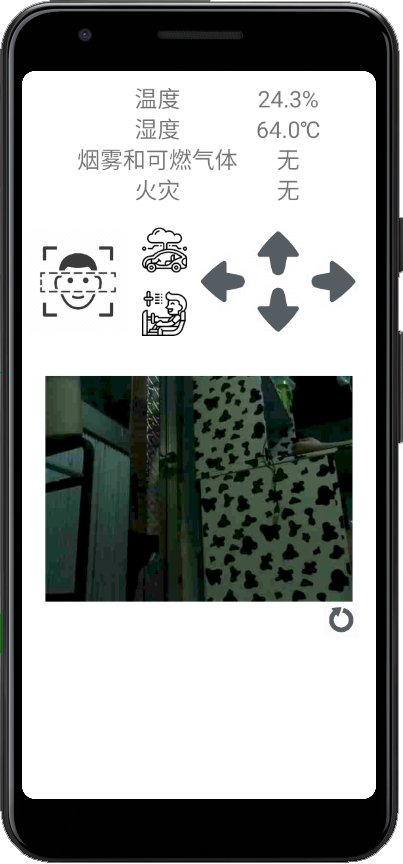

## 目录说明

<mark>点我查看</mark>

<pre><code>
├──other                         其他的一些代码（该文件与本项目无关）
├──SecurityRobot_Server          运行在云服务器
│  │  FaceDetection_Img          用来存储TCP接受的图像
│  │  socket_server.py           TCP服务器
│  │  flaskProject               flask Web服务
├──SecurityRobot_RPi             运行在树莓派
│  │  FaceDetection_Img          存储人脸识别到的图像
│  │  carcon.py                  机器人的移动初始化和控制
│  │  dht11                      dht11传感器的库文件
│  │  FaceDetection.py           人脸检测
│  │  haarcascade_frontalface_default.xml      人脸检测训练集
│  │  mqtt_pub.py                MQTT发布消息
│  │  mqtt_sub.py                MQTT订阅消息，控制机器人移动
│  │  smoke.py                   MQ-2烟雾传感器
│  │  fire.py                    火焰传感器
│  │  socket_client.py           TCP客户端（发送图像给TCP服务器）
│  │  socket_client_video.py     TCP客户端（发送视频）
│  │  TempHumi.py                DHT11温湿度传感器
│  │  auto_navigation.py         自主巡航
│  │  ultrasonic_left.py         左超声波传感器
│  │  ultrasonic_right.py        右超声波传感器
│  │  ultrasonic_mid.py          中超声波传感器
│  │  SecurityRobot.py           主程序
├──SecurityRobot_Android         用Android Studio编写
</code></pre>

## 网络端口说明（服务器）
12000： TCPsocket端口（传输人脸识别图像）
1883： MQTT端口（传输环境数据）
80： Apache端口 
5000： Flask服务
8002：TCPsocket端口（传输实时视频）

